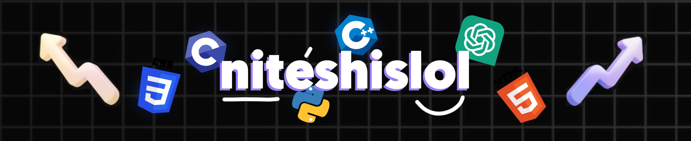

<h1> Hello World!👋, I'm Nitesh   A Machine Learning Enthusiast  : </h1>

👨🏼‍🎓 Currently studying <strong>Computer Science Engineering</strong> at <strong>UTD-CSVTU, Bhilai</strong> - Passionate about <strong>Artificial Intelligence</strong> and <strong>Machine Learning</strong>.<!--  🛜 Cure-->  👨🏼‍💻 Working as a <strong> Graphic designer</strong> since 2021.  🎬 Just Started out With My Youtube Channel <strong>LoLgoRithmS by Nitesh</strong>
 

<h2> 💻 Tech Stack : </h2>

  
  
  
  
  
  
  
  
  
  
  
  
  
  

<h2> 👀 Visitor Count : </h2>

<h2>⚡️Where to find me : </h2>

<picture>
  <source media="(prefers-color-scheme: dark)" srcset="https://raw.githubusercontent.com/niteshislol/niteshislol/output/github-snake-dark.svg" />
  <source media="(prefers-color-scheme: light)" srcset="https://raw.githubusercontent.com/niteshislol/niteshislol/output/github-snake.svg" />
  
</picture>

<!-- <h2>❤️ Support Me</h2>

 
-->
